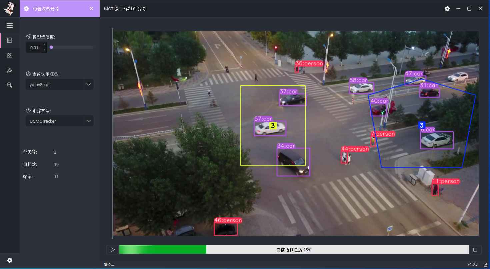

# 基于yolov8和UCMCTracker/DeepSort的多目标跟踪系统
# 
## 安装依赖
```bash
pip install -r requirements.txt
pip3 install torch torchvision torchaudio --index-url https://download.pytorch.org/whl/cu121
```
## 运行
> 在开始运行前，需要将yolov8的模型文件放在weights文件夹下，模型文件可以在yolov8官网下载

```bash
mkdir weights
```

> ## **Windows**:
```console
python main.py
```
> ## **MacOS and Linux**:
```console
python3 main.py
```

## 运行截图



ps: 废物大学生，代码写的很烂，很多都是借鉴别人的，有问题请多多指教
