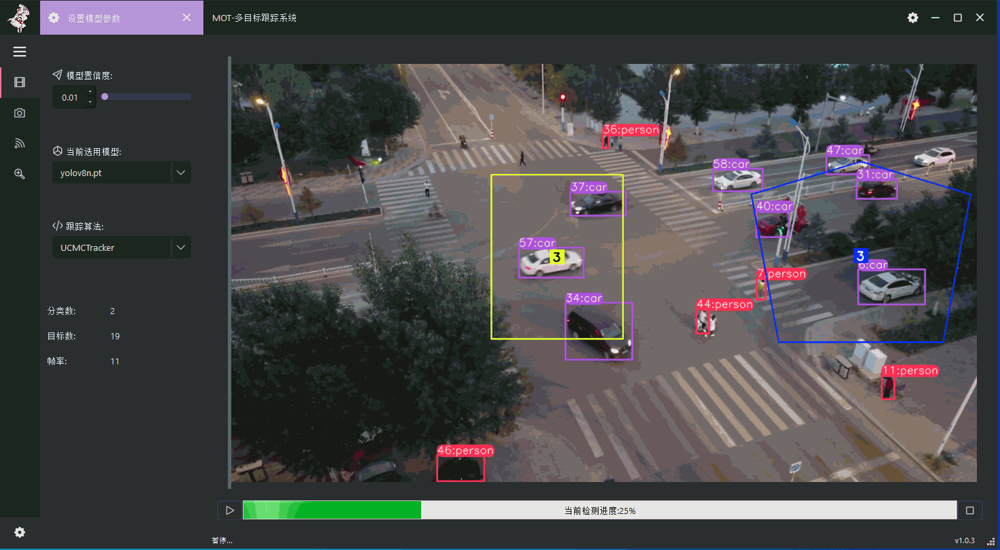

# 基于yolov8和UCMCTracker/DeepSort的多目标跟踪系统

> 本项目是一个强大的多目标跟踪系统，基于[yolov8](链接)和[UCMCTracker/DeepSort](链接)构建。

## 🎯 功能

- **多目标跟踪**：可以实现对视频中的多目标进行跟踪。
- **目标检测**：可以实现对视频中的目标进行检测，检测的目标会在视频中进行标注，同时会在视频中显示目标的id，方便进行目标的跟踪。
- **视频流输入**：支持mp4文件，本地摄像头，网络rtsp视频流。
- **模型参数修改**：可以修改跟踪算法和置信度。
- **多种额外功能**：实现了包括越线计数，区域计数，热力图，速度估计，距离估计，单目标跟踪功能。


## 🚀 安装依赖
```bash
pip install -r requirements.txt
pip3 install torch torchvision torchaudio --index-url https://download.pytorch.org/whl/cu121
```
## 🏃 运行
> 在开始运行前，需要将yolov8的模型文件放在weights文件夹下，模型文件可以在yolov8官网下载

```bash
mkdir weights
```

> ## **Windows**:
```console
python main.py
```
> ## **MacOS and Linux**:
```console
python3 main.py
```

## 📸 运行截图



